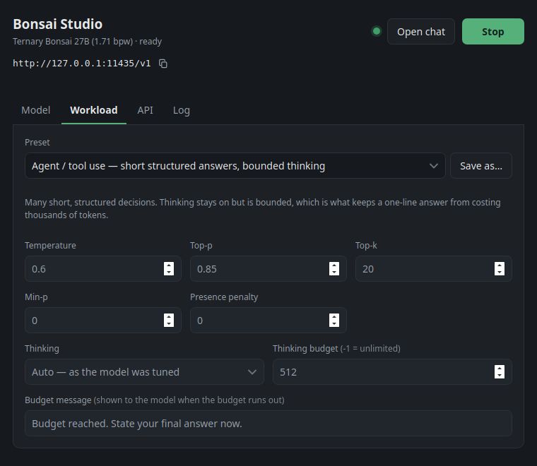

# Bonsai Studio

A desktop app for running [Bonsai 27B](https://docs.prismml.com/models/bonsai-27b)
locally: a start/stop button, an options dialog, and an OpenAI-compatible API on
`http://127.0.0.1:11435/v1`.

Bonsai is a Qwen-derived family quantized end-to-end to ternary or binary
weights. The ternary builds run 5.9-7.2 GB deployed while keeping close to FP16
quality, which is what puts a 27B model on a single consumer GPU.



## Install

Download the build for your platform from
[Releases](https://github.com/arkady-emelyanov/bonsai-studio/releases). Model
weights are fetched on first run, not bundled.

Linux and Windows builds use the Vulkan backend, so they work on NVIDIA, AMD and
Intel GPUs with no CUDA install. macOS is Apple Silicon only and uses Metal.
The binaries are unsigned: macOS needs right-click → Open, and Windows
SmartScreen warns on first launch.

## Using it

Pick a variant, press **Download**, then **Start**. **Open chat** opens
llama-server's own web UI — image upload, reasoning-effort picker, MCP client —
in your browser.

Point any OpenAI client at `http://127.0.0.1:11435/v1`; the API key is ignored
unless you set one. The endpoint serves the same model, with vision and native
tool calling.

## Variants

| Variant | Packing | Size | Notes |
| --- | --- | --- | --- |
| Ternary Bonsai 27B | Q2_0 group-64, 1.71 bpw | 7.6 GB | best quality of the originals |
| Bonsai 27B | Q1_0, 1 bit | 3.5 GB | half the footprint |
| Ternary Bonsai 2 27B | PTQ1_0, 1.76 bpw | 5.9 GB | newer model, densely packed trits |
| Ternary Bonsai 2 27B | PQ2_0, 2.13 bpw | 7.2 GB | macOS only — same weights, cheaper to unpack, so prompts process faster |

Ternary Bonsai 2 stores its weights in a rotated basis and needs a runtime
Walsh-Hadamard transform, so the bundled `llama-server` comes from the
[PrismML fork](https://github.com/PrismML-Eng/llama.cpp) rather than upstream.
PQ2_0 is macOS only because those kernels exist for CUDA and Metal but not
Vulkan, and the Linux and Windows bundles are Vulkan builds so they run on AMD
and Intel without a CUDA install.

## Workloads

Sampling and thinking move together, because they are one decision. The
**Workload** tab picks a profile, and a profile sets both:

| Profile | Sampling | Thinking |
| --- | --- | --- |
| Chat | temp 1.0, top-p 0.95 | on, unbounded |
| Instruct | temp 0.7, top-p 0.80, presence penalty 1.5 | off |
| Agent / tool use | temp 0.6, top-p 0.85, no presence penalty | on, bounded to 512 tokens |

Chat and Instruct are the values the model card gives for thinking and
non-thinking use. Agent is for many short structured answers — a schema-shaped
decision per request — where an unbounded chain spends thousands of tokens
deliberating before a one-line answer. Bounding the thinking is what brings a
request from minutes to seconds; the presence penalty is deliberately left at
zero, because a schema-constrained reply has to repeat field names and
punctuation.

Editing any value switches to **Custom**, and **Save as** keeps a named profile
of your own, sampling and thinking together. Every setting is a launch flag, so
changes apply on the next start — the app says so, with a **Restart** button,
whenever what is running has drifted from what the panel shows.

## Memory

Published peak figures for the ternary build, and what they mean for a 12 GiB
card:

| Profile | Context | KV cache | Est. peak |
| --- | --- | --- | --- |
| Default | 16K | f16 | ~9 GB |
| 64K | 64K | q4_0 | ~9.4 GB |
| 100K | 100K | q4_0 | ~10.1 GB |
| Max | 262K | q4_0 | ~12.8 GB |

Only 16 of the model's 64 blocks use full attention — the rest are linear —
which is why the cache grows so slowly. The app estimates peak usage and warns
before starting if it exceeds free VRAM.

## Building

```bash
make run      # start it
make build    # release bundles
make test
```

`make` stages the sidecar first when none is present. `scripts/fetch-sidecar.sh`
fetches `llama-server` and its libraries from the release pinned in
`.llama-cpp-version`; re-run it as `make sidecar` after changing that pin, and
set `BONSAI_RELEASE_REPO` to build against stock upstream llama.cpp, which runs
everything except Ternary Bonsai 2. See [app/README.md](app/README.md) for the
architecture and the settings model.

## Releasing

Push a version tag; `.github/workflows/release.yml` builds all four targets,
assembles a draft release, and publishes it once every platform succeeds.

```bash
git tag v1.0.0 && git push origin v1.0.0
```

## Licence

The app is [MIT](LICENSE). llama.cpp is MIT and its binaries ship inside the
release bundles, carrying their own licence file. The Bonsai weights are
Apache-2.0 and are downloaded from Hugging Face at runtime, not redistributed
here.
